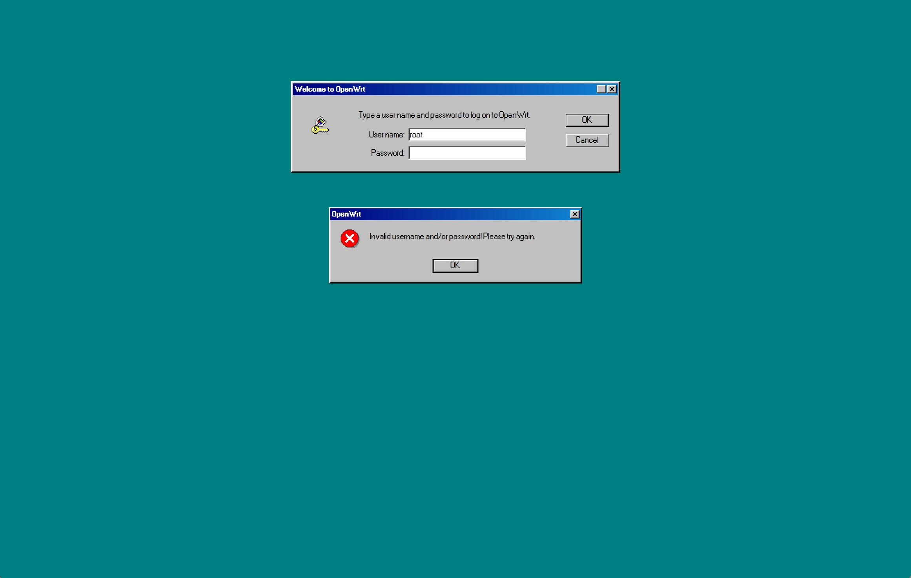
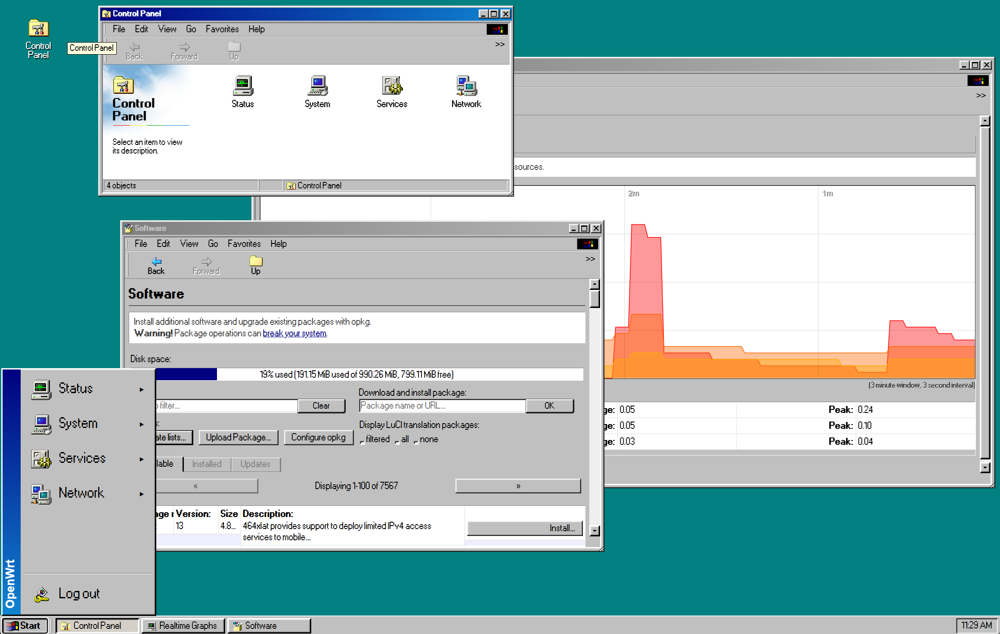

# luci-theme-win98

`luci-theme-win98` 是一个面向 OpenWrt 24.x / LuCI 的 Windows 98 风格主题。它把 LuCI 界面改造成类似 Win98 桌面的体验，包括灰色窗口、立体按钮、凹陷输入框、蓝色标题栏、青绿色桌面背景和固定底部任务栏。

## 预览





## 特性

- 适配 OpenWrt 24.x / LuCI ucode 主题结构
- Windows 98 风格桌面、任务栏、窗口、选项卡、按钮和表单
- 经典菜单图标来自 GPL-2.0 授权的 `nestoris/Win98SE` 图标主题，运行时图标位于 `htdocs/luci-static/win98/icons/menu/`
- Start 按钮徽标来自 Wikimedia Commons 的公有领域 `Windows logo - 1992.svg`
- 使用 MIT 授权 `jdan/98.css` 项目中的 `Pixelated MS Sans Serif` 作为主要 UI 字体
- 静态资源路径为 `/luci-static/win98`
- LuCI 主题注册名为 `Win98`
- 包含登录页、页头、页脚、桌面图标、表格、表单、提示框和移动端样式
- 可在本地直接打包为 `.ipk`

## 目录结构

```text
htdocs/luci-static/win98/         # 静态资源和 CSS
ucode/template/themes/win98/      # LuCI ucode 模板
root/etc/uci-defaults/            # 主题注册脚本
scripts/build_ipk.py              # 本地 .ipk 打包脚本
```

## 在 OpenWrt Feed 中使用

将本目录放到 LuCI feed 路径下，然后执行：

```sh
./scripts/feeds update -a
./scripts/feeds install luci-theme-win98
make menuconfig
```

在 menuconfig 中启用：

```text
LuCI -> Themes -> luci-theme-win98
```

安装后，在 LuCI 主题设置中切换到 `Win98`。

也可以通过 UCI 命令切换主题：

```sh
uci set luci.main.mediaurlbase='/luci-static/win98'
uci commit luci
rm -f /tmp/luci-indexcache.*
rm -rf /tmp/luci-modulecache/
/etc/init.d/rpcd reload
```

## 本地打包

仓库内置了不依赖 OpenWrt buildroot 的打包脚本：

```sh
python scripts/build_ipk.py
```

每次运行都会自动递增 `scripts/build_ipk.py` 里的包版本修订号，例如从 `2026.05.16-r13` 递增到 `2026.05.16-r14`，并使用新版本写入 package control metadata。默认产物输出到 `dist/`。也可以指定输出路径：

```sh
python scripts/build_ipk.py --out dist/luci-theme-win98.ipk
```

## GitHub Actions

仓库内置的 workflow 会在 push、pull request 和手动触发时构建包，并上传 `.ipk` 产物。
